# Citnega — Orchestration Architecture

## Component Interaction Map

```mermaid
flowchart TD
    %% ─── Entry points ───────────────────────────────────────────────────────
    TUI["TUI / CLI\n(apps/tui · apps/cli)"]
    TUI -->|"run_turn(session_id, user_input)"| AppSvc

    %% ─── Application Service ─────────────────────────────────────────────────
    subgraph APP["Application Layer"]
        AppSvc["ApplicationService\n(packages/runtime/app_service.py)"]
        ApprovalMgr["ApprovalManager\n(policy/approval_manager.py)"]
        AppSvc --- ApprovalMgr
    end

    %% ─── CoreRuntime ─────────────────────────────────────────────────────────
    AppSvc -->|"create_run → dispatch"| CoreRT
    subgraph RT["CoreRuntime  (packages/runtime/core_runtime.py)"]
        CoreRT["CoreRuntime"]
        SessMgr["SessionManager"]
        RunMgr["RunManager"]
        CtxAssembler["ContextAssembler\n(assembles context_obj)"]
        CoreRT --> SessMgr
        CoreRT --> RunMgr
        CoreRT --> CtxAssembler
    end

    %% ─── Context assembly ─────────────────────────────────────────────────────
    subgraph CTX["Context Handlers  (runtime/context/handlers/)"]
        H1["RecentTurnsHandler\n(last N messages)"]
        H2["SessionSummaryHandler\n(run summaries)"]
        H3["KBRetrievalHandler\n(semantic KB lookup)"]
        H4["RuntimeStateHandler\n(mode, phase, config)"]
        H5["TokenBudgetHandler\n(prune to token limit)"]
    end
    CtxAssembler --> H1 & H2 & H3 & H4 & H5
    H3 -->|"vector search"| KBStore

    %% ─── Framework Adapter ────────────────────────────────────────────────────
    CoreRT -->|"context_obj"| Adapter
    subgraph FW["Framework Adapter  (adapters/direct/)"]
        Adapter["DirectModelAdapter\n(adapter.py)"]
        Runner["DirectModelRunner\n(runner.py)\n\n① resolve model\n② build system prompt\n③ stream LLM call\n④ tool-call loop"]
        Adapter -->|"create runner per session"| Runner
    end

    %% ─── System Prompt Construction ──────────────────────────────────────────
    subgraph SP["System Prompt  (built inside runner.run_turn)"]
        SP1["Base prompt\n(ConversationStore._SYSTEM_PROMPT\n+ tools schema)"]
        SP2["Mode augmentation\nmode.augment_system_prompt(phase)"]
        SP3["Strategy context\n_build_strategy_context()\n→ active skills + mental model clauses"]
        SP4["Ambient context\n_build_ambient_context()\n→ cwd · git branch · git status · time"]
        SP5["KB context\nsemanticly retrieved chunks"]
        SP1 --> SP2 --> SP3 --> SP4 --> SP5
    end
    Runner -->|"assembles"| SP

    %% ─── Session Modes ────────────────────────────────────────────────────────
    subgraph MODES["Session Modes  (protocol/modes.py)"]
        direction LR
        M1["ChatMode\ntemp 0.7"]
        M2["CodeMode\ntemp 0.2"]
        M3["PlanMode\ntemp 0.4"]
        M4["ResearchMode\ntemp 0.3"]
        M5["ExploreMode\ntemp 0.8"]
        M6["ReviewMode\ntemp 0.3\nmax_rounds 8"]
        M7["OperateMode\ntemp 0.2\nmax_rounds 8"]
    end
    SP2 -.->|"get_mode(conv.mode_name)"| MODES

    %% ─── Model Gateway ────────────────────────────────────────────────────────
    Runner -->|"stream_generate(ModelRequest)"| Gateway
    subgraph GW["Model Gateway  (packages/model_gateway/)"]
        Gateway["ModelGateway\n(routing + rate limiting)"]
        RL["TokenBucketRateLimiter"]
        MReg["ModelRegistry\n(models.yaml)"]
        P1["OllamaProvider"]
        P2["OpenAICompatibleProvider"]
        P3["VLLMProvider"]
        P4["CustomRemoteProvider"]
        Gateway --> RL
        Gateway --- MReg
        Gateway --> P1 & P2 & P3 & P4
    end
    Gateway -->|"token stream"| Runner

    %% ─── Tool-Call Loop ──────────────────────────────────────────────────────
    Runner -->|"LLM requests tool call"| Enforcer
    subgraph POL["Policy Layer  (runtime/policy/)"]
        Enforcer["PolicyEnforcer\n(enforcer.py)"]
        ApprovalMgr2["ApprovalManager\n(prompts user for\nrequires_approval tools)"]
        Enforcer -->|"needs approval?"| ApprovalMgr2
    end
    Enforcer -->|"allowed"| ToolDispatch

    subgraph DISPATCH["Tool Dispatch  (runner._execute_tool_call_delta)"]
        ToolDispatch["resolve name in\nself._all_callables"]
        Parallel["Fan-out parallel execution\n(asyncio TaskGroup)"]
        ToolDispatch -->|"independent calls"| Parallel
    end

    %% ─── Tools ────────────────────────────────────────────────────────────────
    Parallel -->|"call"| ToolLayer
    subgraph TOOLS["Built-in Tools  (packages/tools/builtin/)  ~45 tools"]
        direction LR
        T_FS["Filesystem\nread_file · write_file\nedit_file · list_dir\nsearch_files"]
        T_EXEC["Execution\nrun_shell · git_ops"]
        T_WEB["Web\nfetch_url · search_web\nread_webpage · web_scraper"]
        T_DATA["Data Analysis\npandas_analyze · sql_query\ndata_profiler · pivot_table"]
        T_DOC["Document Output\nwrite_pdf · write_docx\ncreate_ppt · create_excel\nrender_chart"]
        T_COMM["Communication\nemail_composer · slack_notifier\ncalendar_event"]
        T_UTIL["Utilities\ntranslate_text · ocr_image · qr_code\ndiff_compare · csv_to_json\ncalculate · get_datetime"]
        T_QA["QA / Arch\nrepo_map · quality_gate\ntest_matrix · artifact_pack"]
        T_KB["Knowledge Base\nread_kb · write_kb"]
        T_SEC["Security  (14 tools)\nvuln_scanner · secrets_scanner\nport_scanner · dns_recon …"]
    end
    ToolLayer["BaseCallable\n_execute(input, context)"] --> T_FS & T_EXEC & T_WEB & T_DATA & T_DOC & T_COMM & T_UTIL & T_QA & T_KB & T_SEC

    %% ─── Agents as Tools ─────────────────────────────────────────────────────
    Parallel -->|"call specialist agent"| AgentLayer
    subgraph AGENTS["Specialist Agents  (packages/agents/specialists/)  17 agents"]
        direction LR
        A_CODE["code_agent"]
        A_PLAN["planner_agent"]
        A_ORCH["orchestrator_agent"]
        A_QA["qa_agent"]
        A_SEC["security_agent\n14 security tools"]
        A_RES["research_agent\nweb + KB"]
        A_BA["business_analyst_agent"]
        A_DA["data_analyst_agent"]
        A_DS["data_scientist_agent"]
        A_SRE["sre_agent"]
        A_MLE["ml_engineer_agent"]
        A_RISK["risk_manager_agent"]
        A_FC["financial_controller_agent"]
        A_LAW["lawyer_agent"]
    end
    AgentLayer["SpecialistBase\n_execute → gather context\n→ _call_model(LLM)\n→ return result"] --> A_CODE & A_PLAN & A_ORCH & A_QA & A_SEC & A_RES & A_BA & A_DA & A_DS & A_SRE & A_MLE & A_RISK & A_FC & A_LAW
    AgentLayer -->|"nested tool calls\nvia TOOL_WHITELIST"| ToolLayer

    %% ─── Capability Registry ─────────────────────────────────────────────────
    subgraph CAP["Capability Registry  (packages/capabilities/)"]
        CapReg["CapabilityRegistry\n(in-memory index of all capabilities)"]
        BP["BuiltinCapabilityProvider\n(tools + agents → descriptors)"]
        BSP["BuiltinSkillProvider\n(20 built-in skills → BUILTIN_SKILLS list)"]
        WSP["WorkspaceCapabilityProvider\nworkfolder/skills/*.md"]
        MMP["MentalModelCapabilityProvider\nworkfolder/mental_models/*.md"]
        BP --> CapReg
        BSP -->|"overwrite=False\n(workspace wins)"| CapReg
        WSP -->|"overwrite=True"| CapReg
        MMP -->|"overwrite=True"| CapReg
    end
    Runner -->|"lookup active skills\n+ mental_model_spec"| CapReg

    %% ─── Skills ──────────────────────────────────────────────────────────────
    subgraph SKILLS["Built-in Skills  (packages/skills/builtins.py)  20 skills"]
        direction LR
        SK1["Core\nsecurity_review · code_review\nresearch_protocol · debug_session\ndeploy_checklist"]
        SK2["Business & Finance\nrequirements_gathering · stakeholder_report\nvariance_analysis · audit_protocol"]
        SK3["Data & ML\neda_protocol · dashboard_design\nml_experiment · model_review\nmodel_deployment"]
        SK4["Operations & SRE\nincident_response · postmortem"]
        SK5["Risk & Legal\nrisk_assessment · control_testing\ncontract_review · legal_research_protocol"]
    end
    BSP -.->|"reads"| SKILLS

    %% ─── Mental Models ────────────────────────────────────────────────────────
    MM["Mental Models\nworkfolder/mental_models/*.md\n(behavioral clauses injected\ninto system prompt per turn)"]
    MMP -.->|"compiles"| MM

    %% ─── Knowledge Base ──────────────────────────────────────────────────────
    subgraph KB["Knowledge Base  (packages/kb/)"]
        KBStore["KnowledgeStore\n(SQLite + vector index)"]
    end
    T_KB --> KBStore

    %% ─── Storage ─────────────────────────────────────────────────────────────
    subgraph STORE["Storage  (packages/storage/)"]
        DB["SQLite / Alembic\n(aiosqlite)"]
        SRepo["SessionRepository"]
        RRepo["RunRepository"]
        MRepo["MessageRepository"]
        IRepo["InvocationRepository"]
    end
    DB --- SRepo & RRepo & MRepo & IRepo
    SessMgr --> SRepo
    RunMgr --> RRepo

    %% ─── Observability ───────────────────────────────────────────────────────
    subgraph OBS["Observability"]
        Emitter["EventEmitter\n(async event bus)"]
        Tracer["Tracer\n(tool invocation log)"]
    end
    Runner -->|"TokenEvent · ThinkingEvent\nToolCallEvent · ToolResultEvent"| Emitter
    ToolLayer -->|"record"| Tracer
    Emitter -->|"stream to"| TUI

    %% ─── Bootstrap wiring (startup only) ────────────────────────────────────
    BOOT["Bootstrap\ncreate_application()\n28 steps"]
    BOOT -.->|"wires at startup"| AppSvc & CoreRT & CapReg & GW & POL & OBS & STORE
```



---

## Turn Execution Flow (Step by Step)

```
User types message
        │
        ▼
TUI ChatController.submit_message()
        │
        ▼
AppService.run_turn(session_id, user_input)
        │
        ├─► SessionManager   — load session config (model, mode, framework)
        ├─► RunManager       — create Run record (state=RUNNING)
        ├─► ContextAssembler — run all handlers → context_obj
        │       ├── RecentTurnsHandler    → last N messages from DB
        │       ├── KBRetrievalHandler    → semantic KB chunks matching user_input
        │       ├── SessionSummaryHandler → compressed prior run summaries
        │       ├── RuntimeStateHandler   → mode name, plan phase, config
        │       └── TokenBudgetHandler    → prune context to token limit
        │
        ▼
DirectModelRunner.run_turn(user_input, context_obj, event_queue)
        │
        ├─ 1. Resolve model_id  (from context_obj or ConversationStore)
        ├─ 2. Build system prompt:
        │       base_prompt        ← ConversationStore._SYSTEM_PROMPT + tools JSON schema
        │       + mode.augment()   ← per-mode instructions + temperature + max_tool_rounds
        │       + strategy_block   ← active skill bodies + mental model clauses (CapabilityRegistry)
        │       + ambient_block    ← cwd, git branch, git status, current time (subprocess)
        │       + KB chunks        ← from context_obj.sources (kb type)
        │
        ├─ 3. Stream LLM call → ModelGateway.stream_generate()
        │       → Provider (Ollama / OpenAI-compat / vLLM / custom)
        │       → emit TokenEvent per chunk → TUI updates in real-time
        │
        └─ 4. Tool-call loop  (up to mode.max_tool_rounds)
                │
                ├─ LLM returns tool_calls in response
                ├─ PolicyEnforcer.check(tool, context)
                │       ├── network_allowed?    (blocks if deny_network=True)
                │       ├── path_allowed?       (workspace boundary check)
                │       └── requires_approval?  → ApprovalManager → TUI prompt → user Y/N
                │
                ├─ Fan-out: independent tool calls execute in parallel (asyncio TaskGroup)
                │
                ├─ Tool is a TOOL  →  BaseCallable._execute(input, CallContext)
                │       CallContext carries: session_id, run_id, model_gateway,
                │                            mode_temperature, enforcer, emitter, tracer
                │
                └─ Tool is a SPECIALIST agent  →  SpecialistBase._execute(input, CallContext)
                        ├─ gather tool context via TOOL_WHITELIST (call sub-tools)
                        └─ _call_model(LLM)  →  synthesise and return result
                                (agents get their own LLM call with specialist SYSTEM_PROMPT)
```

---

## Capability Priority (overwrite rules)

```
Priority (highest → lowest):

  workspace/mental_models/*.md   overwrite=True   ← user-authored behavioral clauses
  workspace/skills/*.md          overwrite=True   ← user-authored custom skills
  packages/skills/builtins.py    overwrite=False  ← 20 built-in domain skills
  packages/tools/ + agents/      overwrite=True   ← all tools and agents (base)
```

---

## Key Design Principles

| Principle | Where applied |
|-----------|--------------|
| **DIP** — depend on interfaces, not concretions | `IFrameworkRunner`, `ISessionMode`, `IInvocable`, `IEventEmitter` — bootstrap wires concrete impls |
| **OCP** — extend via composition, not modification | New tools → add to `ToolRegistry`. New agents → add to `ALL_SPECIALISTS`. New skills → add to `BUILTIN_SKILLS`. No runner changes. |
| **SRP** — one responsibility per layer | Runner: prompt + streaming. PolicyEnforcer: access control. ContextAssembler: context hydration. CapabilityRegistry: capability index. |
| **DRY** — single source of truth | `tool_policy()` factory for all tool policies. `_deps()` in ToolRegistry for shared infra. `BUILTIN_SKILL_INDEX` auto-built from `BUILTIN_SKILLS` list. |
| **Lazy imports** | All optional-dependency tools (fpdf2, pptx, openpyxl, pytesseract, qrcode…) import inside `_execute()` — package installs cleanly without optional libs. |
